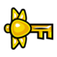
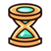

# Icônes extraites de la carte interactive

> Icônes de marqueurs extraites depuis le sprite atlas de `minishoot-map/minishoot-map.github.io` (`src/data-raw/markers/markers.png`). Usage : repères visuels pour le guide FR.
>
> 🗺️ Ces icônes viennent de la carte interactive, qui fait foi pour les catégories de marqueurs.

| Catégorie | Icône | Label | textureI | Fichier |
| --- | --- | --- | ---: | --- |
| module |  | Module / équipement | 26 | `module.png` |
| skill |  | Skill / pouvoir | 23 | `skill.png` |
| heart |  | Heart crystal / vie | 18 | `heart-crystal.png` |
| energy |  | Energy upgrade | 17 | `energy-upgrade.png` |
| scarab |  | Scarabée doré | 179 | `golden-scarab.png` |
| race |  | Race spirit | 124 | `race-spirit.png` |
| map |  | Fragment de carte | 24 | `map-piece.png` |
| lore |  | Tablette lore | 25 | `lore-tablet.png` |
| key |  | Clé normale | 136 | `regular-key.png` |
| key |  | Clé boss | 137 | `boss-key.png` |
| key |  | Clé unique finale | 122 | `unique-key-final.png` |
| key |  | Clé scarabée | 123 | `unique-key-scarab.png` |
| crystal |  | Gros cristal / red coin | 12 | `big-crystal.png` |
| tunnel |  | Tunnel | 16 | `tunnel.png` |
| modules |  | Retaliation | 26 | `modules-retaliation.png` |
| modules |  | Teleport | 27 | `modules-teleport.png` |
| modules |  | Compass | 28 | `modules-compass.png` |
| modules |  | CollectableScan | 29 | `modules-collectablescan.png` |
| modules |  | Overcharge | 30 | `modules-overcharge.png` |
| modules |  | IdolAlly | 31 | `modules-idolally.png` |
| modules |  | IdolBomb | 32 | `modules-idolbomb.png` |
| modules |  | IdolSlow | 33 | `modules-idolslow.png` |
| modules |  | FreePower | 34 | `modules-freepower.png` |
| modules |  | BoostCost | 115 | `modules-boostcost.png` |
| modules |  | XpGain | 116 | `modules-xpgain.png` |
| modules |  | HpDrop | 117 | `modules-hpdrop.png` |
| modules |  | HearthCrystal | 118 | `modules-hearthcrystal.png` |
| modules |  | PrimordialCrystal | 119 | `modules-primordialcrystal.png` |
| modules |  | BlueBullet | 120 | `modules-bluebullet.png` |
| modules |  | Rage | 121 | `modules-rage.png` |
| modules |  | SpiritDash | 170 | `modules-spiritdash.png` |
| skills |  | Boost | 23 | `skills-boost.png` |
| stats |  | BulletNumber | 114 | `stats-bulletnumber.png` |
| skills |  | Dash | 23 | `skills-dash.png` |
| skills |  | Supershot | 23 | `skills-supershot.png` |
| skills |  | Hover | 23 | `skills-hover.png` |
| stats |  | PowerBombLevel | 164 | `stats-powerbomblevel.png` |
| stats |  | PowerSlowLevel | 168 | `stats-powerslowlevel.png` |
| stats |  | PowerAllyLevel | 169 | `stats-powerallylevel.png` |

---

## Source / attribution

- Source : `minishoot-map/minishoot-map.github.io` → `src/data-raw/markers/markers.png` et `src/data-processed/markers.json`.
- Le repo de la carte est publié sous **Unlicense**.
- Les icônes sont utilisées ici comme repères visuels de guide, alignés avec les filtres de la carte interactive.
