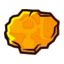
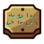

# 🎮 Guide visuel rapide — Minishoot' Adventures

> Quoi chercher, avec quel filtre, et quelle page ouvrir.
>
> La carte interactive est la **référence absolue** pour les emplacements, coordonnées, catégories et quantités.

🗺️ Carte interactive : <https://minishoot-map.github.io/>  
📚 Sommaire : [README](README.md)

---

## 🚀 Si tu veux finir à 100%

| Étape | Picto | Action | Page |
| ---: | --- | --- | --- |
| 1 | 🧭 | avancer l’histoire proprement | [Soluce](soluce.md) |
| 2 | 🧱 | vérifier les secrets faciles à rater | [Secrets](secrets.md) |
| 3 | 🧩 | nettoyer modules et skills | [Modules et skills](modules-et-skills.md) |
| 4 | ❤️ | vérifier cœurs / énergie | [Cœurs et énergie](coeurs-et-energie.md) |
| 5 | 🪲 | ramasser les scarabées dorés | [Scarabées dorés](scarabees-dores.md) |
| 6 | 🏁 | terminer les 8 courses | [Courses et race spirits](courses-et-race-spirits.md) |
| 7 | ✅ | checklist finale | [Checklist 100%](checklist-100-pourcent.md) |
| 8 | 🛠️ | diagnostiquer ce qui manque | [Dépannage](depannage-problemes-frequents.md) |

---

## 🗺️ Filtres de la carte interactive

| Filtre map | Icône | Sert à trouver | Page claire |
| --- | --- | --- | --- |
| Modules & Skills |   | modules, skills, upgrades liés | [Modules et skills](modules-et-skills.md) |
| Heart crystals |  | cœurs / HP | [Cœurs et énergie](coeurs-et-energie.md) |
| Energy upgrades |  | énergie | [Cœurs et énergie](coeurs-et-energie.md) |
| Scarabs |  | scarabées dorés | [Scarabées dorés](scarabees-dores.md) |
| Race spirits |  | courses | [Courses et race spirits](courses-et-race-spirits.md) |
| Map & Lore |   | cartes + lore | [Cartes, lore et clés](cartes-lore-et-cles.md) |

✅ Méthode : active **un seul filtre à la fois**, puis nettoie zone par zone.

---

## 🏁 Courses — repères visuels rapides

| Course | Repère principal | Page |
| ---: | --- | --- |
| #1 | passage sable / canyon rocheux | [Recherche deep](recherche-courses-deep.md) |
| #2 | tour avec symbole de 3 slimes + accès souterrain | [Course #2 détaillée](recherche-courses-deep.md#course-2--acces-detaille-car-cest-la-plus-problematique) |
| #3 | forêt sombre / zone bleutée | [Recherche deep](recherche-courses-deep.md) |
| #4 | couloir rocheux / ruines | [Recherche deep](recherche-courses-deep.md) |
| #5 | forêt rouge / orange | [Recherche deep](recherche-courses-deep.md) |
| #6 | chemins de pierre / zone sombre | [Recherche deep](recherche-courses-deep.md) |
| #7 | désert / ville dorée | [Recherche deep](recherche-courses-deep.md) |
| #8 | lagon / jungle / eau turquoise | [Recherche deep](recherche-courses-deep.md) |

À retenir : la **course #2** est celle qui piège le plus. Cherche la tour aux **3 slimes**.

---

## 🧩 Modules souvent importants / oubliés

| Module / cas | Pourquoi vérifier |
| --- | --- |
| Family Home | récompense/module très souvent oublié |
| Vendeur scarabées | récompense après échanges, pas juste collecte |
| Récompense des 8 courses | gagner les courses ne suffit pas : récupérer l’objet final |
| Wounded Heart | passage caché près de l’autel |
| CollectableScan / Compass | utiles pour nettoyer efficacement |

---

## 🛠️ Diagnostic rapide

| Ce qui manque | Première vérification | Page |
| --- | --- | --- |
| Module | Family Home / vendeur scarabées / récompense courses | [Dépannage](depannage-problemes-frequents.md) |
| Course | filtre Race spirits + course #2 | [Courses](courses-et-race-spirits.md) |
| Scarabée | filtre Scarabs zone par zone | [Scarabées](scarabees-dores.md) |
| Cœur / énergie | filtres Heart / Energy | [Cœurs et énergie](coeurs-et-energie.md) |
| Lore / carte | filtre Map & Lore | [Cartes, lore et clés](cartes-lore-et-cles.md) |

---

## 🧠 Règle finale

Si tu es perdu :

1. ouvre [Parcours 100%](parcours-100.md)
2. ouvre la carte interactive
3. active un seul filtre
4. compare avec la page claire
5. utilise [Dépannage](depannage-problemes-frequents.md) si ça bloque
