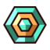
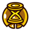
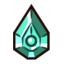
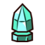

# 🧩 Guide des modules

> Légende des pictos : [Pictogrammes du guide](pictogrammes.md)

> Le succès/trophée **Suréquipément / Overstuffed** demande de **trouver tous les modules**. C’est l’un des objectifs les plus flous du jeu, car la carte peut afficher 100% alors qu’un module lié à un retour PNJ ou à une récompense n’a pas encore été pris.

---

## 🎯 Ce qu’il faut savoir avant tout

Les modules sont les collectibles affichés à droite dans l’inventaire.

D’après les retours communautaires :

- **100% carte ≠ 100% modules garanti**
- certains modules viennent d’un retour à la maison/famille
- certains viennent d’une récompense après scarabées ou courses
- le succès peut parfois se déclencher après changement d’écran, combat, coup reçu ou actualisation d’état

Donc si tu es bloqué : ne cherche pas seulement un point sur la carte. Vérifie aussi les **récompenses non réclamées**.

---

## ⚠️ Les modules / cas les plus souvent ratés

### 🏠 1. Family Home / maison familiale

C’est le cas le plus récurrent dans les discussions Steam.

**Repère :**

- zone de départ / ville principale
- maison en bas à gauche du checkpoint central selon plusieurs joueurs
- après avoir sauvé/réuni la famille, il faut entrer et se placer/interagir correctement près du siège/pédestal/table

**Pourquoi il est raté :**

- l’entrée ressemble à une zone déjà connue
- la carte peut être à 100%
- il ne suffit pas toujours d’entrer : il faut se tenir au bon endroit / déclencher la scène

**À faire si un module manque :** retourne d’abord ici.

Note de recherche : plusieurs threads décrivent ce module comme étant dans / autour de la maison familiale, parfois via une petite cave au sud-ouest du bâtiment de départ après sauvetage de toute la famille robot. La formulation exacte varie selon les joueurs, mais le diagnostic reste le même : **retour maison familiale + bon endroit d’interaction**.

---

### 2. Enchanted Heart

Souvent lié à la progression familiale / maison principale.

**Méthode :**

1. sauver les proches / amis nécessaires
2. retourner à la maison familiale
3. interagir avec la scène familiale
4. vérifier l’inventaire après l’animation ou le dialogue

**Symptôme typique :** “j’ai 100% carte, mais il me manque un module entre deux modules déjà connus”.

---

### 🪲 3. Enchanted Powers / vendeur de scarabées

Plusieurs joueurs ont découvert que leur “dernier module” venait simplement d’une récompense non achetée ou non récupérée auprès du robot/marchand lié aux scarabées dorés.

**À vérifier :**

- as-tu rendu les derniers scarabées ?
- as-tu acheté toutes les améliorations du vendeur ?
- as-tu reparlé au PNJ après le dernier lot ?

**Erreur classique :** avoir tous les scarabées dans la progression, mais oublier le dernier échange.

---

### ❤️ 4. Wounded Heart / Coeur Blessé

Objet lié à la source de la corruption.

**Repère communautaire :**

- sud-ouest de la carte
- temple / chapelle
- autel visible
- passage caché sur le côté droit / derrière l’autel

**Pourquoi il est raté :** le mur secret n’est pas évident, et la zone peut paraître déjà nettoyée.

---

### 🏁 5. Récompense des 8 courses

Après avoir gagné les **8 courses**, il reste une étape : aller récupérer la récompense finale.

**Repère général :** grande zone / temple au sud selon les retours communautaires.

**Erreur classique :** finir les courses une par une, voir le succès de course, puis oublier le retour final qui donne l’objet/module associé.

---

### 6. Donjons optionnels / bâtiments cachés

Certains modules ou pouvoirs ne sont pas sur la ligne principale :

- bâtiment optionnel après la zone du Donjon 2
- désert optionnel après Donjon 3
- bâtiment caché de la région ouest / Donjon 4
- égouts/souterrains de la région ouest

Si tu joues “objectif principal uniquement”, tu peux finir l’histoire en ayant laissé ces lieux derrière toi.

---

## 🖼️ Icônes des modules depuis la carte interactive

Ces images sont les pictogrammes réels utilisés par la map interactive pour les modules/pouvoirs nécessaires.

### 🧩 Modules

| Icône | Module |
| --- | --- |
|  | Retaliation |
|  | Teleport |
|  | Compass |
|  | CollectableScan |
|  | Overcharge |
|  | IdolAlly |
|  | IdolBomb |
|  | IdolSlow |
|  | FreePower |
|  | BoostCost |
|  | XpGain |
|  | HpDrop |
|  | HearthCrystal |
|  | PrimordialCrystal |
|  | BlueBullet |
|  | Rage |
|  | SpiritDash |

### ✨ Skills

| Icône | Skill |
| --- | --- |
|  | Boost |
|  | Dash |
|  | Supershot |
|  | Hover |

## 🗺️ Méthode fiable pour trouver tous les modules

### Étape 1 — Ouvre la carte interactive

➡ <https://minishoot-map.github.io/>

### Étape 2 — Active le filtre utile

- **Modules & Skills**

Puis nettoie zone par zone plutôt que point par point au hasard.

### Étape 3 — Fais la boucle anti-oubli

Dans cet ordre :

1. **Family Home**
2. famille réunie / siège / scène
3. vendeur de scarabées dorés
4. récompense des 8 courses
5. Wounded Heart / temple sud-ouest
6. désert optionnel
7. bâtiment caché zone ouest
8. égouts / souterrains

### Étape 4 — Force l’actualisation du succès si besoin

Si tu es certain d’avoir le dernier module mais que le succès ne tombe pas :

- change de zone
- ouvre/ferme l’inventaire
- combats un ennemi
- prends un coup si nécessaire
- vérifie que tu n’as pas un mode spécial qui bloque une condition

---

## 🛠️ Tableau de diagnostic rapide

| Symptôme | Vérification prioritaire |
| --- | --- |
| Carte à 100%, un module manque | Family Home + vendeur scarabées |
| Module près d’Enchanted Heart manquant | maison familiale / siège / scène |
| Module près d’Enchanted Powers manquant | dernier achat/récompense scarabées |
| Wounded Heart manquant | temple sud-ouest, passage à droite de l’autel |
| Module bas/droite manquant | finir les 8 courses + récupérer la récompense |
| Succès ne pop pas | changer d’écran / combattre / prendre un hit |

---

## ✅ Checklist modules “anti-oubli”

- [ ] Retour à la **Family Home**
- [ ] Famille complètement réunie
- [ ] Interaction finale de famille validée
- [ ] **Wounded Heart / Coeur Blessé** trouvé
- [ ] Tous les **scarabées dorés** rendus
- [ ] Récompense du **vendeur de scarabées** récupérée
- [ ] Les **8 courses** gagnées
- [ ] Récompense des courses récupérée
- [ ] Donjon optionnel du désert terminé
- [ ] Bâtiment caché zone ouest vérifié
- [ ] Égouts / souterrains vérifiés
- [ ] Nettoyage complet via la carte interactive

---

## Sources utilisées pour ce document

- Carte interactive : <https://minishoot-map.github.io/>
- Discussions Steam sur modules manquants : voir [Sources](sources.md)
- Retours Reddit sur modules / Overstuffed
- Guide illustré GitHub : <https://github.com/YAL-Game-Things/Minishoot-Adventures-Guide>
