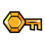
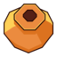
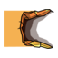

# 🎯 Pictogrammes du guide

> Légende commune utilisée dans tout le guide. Le but : reconnaître immédiatement le type d’info sans relire toute la page.

---

## 🧭 Navigation / progression

| Picto | Signification | Utilisé pour |
| --- | --- | --- |
| 🧭 | Progression | route principale, ordre conseillé |
| 🏠 | Hub / maison / retour PNJ | Family Home, récompenses différées |
| 🚪 | Entrée / passage | caves, temples, tunnels, transitions |
| 🧱 | Mur ou passage caché | secrets, accès discrets |
| ⚠️ | Attention | objet facile à rater, erreur fréquente |
| ✅ | À cocher | checklist ou étape validée |

---

## 🧩 Collectibles / pouvoirs

| Picto | Signification | Utilisé pour |
| --- | --- | --- |
| 🧩 | Module | modules, équipement, Suréquipément |
| ✨ | Skill / pouvoir | Boost, Dash, Hover, Supershot |
| ❤️ | Coeur / vie | Heart crystals, Wounded Heart |
| ⚡ | Énergie | upgrades d’énergie |
| 🪲 | Scarabée doré | scarabs et vendeur scarabées |
| 👻 | Race spirit | esprits de course |
| 🏁 | Course | courses chronométrées |
| 🗺️ | Carte | map pieces, carte interactive |
| 📜 | Lore | tablettes / fragments d’histoire |
| 🔑 | Clé | clés normales, boss keys, clés uniques |
| 💎 | Cristal / red coin | gros cristaux, red coins, jarres |

---

## 🛠️ Recherche / diagnostic

| Picto | Signification | Utilisé pour |
| --- | --- | --- |
| 🛠️ | Dépannage | problème précis à résoudre |
| 🔎 | Source / vérification | sources, fiabilité, recherche deep |
| 📊 | Donnée extraite | JSON/CSV, extraction de la map |
| 📸 | Capture / repère visuel | screenshots, annotations |
| 🎬 | Vidéo | walkthroughs et ressources vidéo |

---

## 🗺️ Icônes réelles de la carte interactive

Ces pictogrammes viennent du sprite atlas de la carte interactive et sont utilisés pour les objets nécessaires au 100%.

| Icône map | Usage dans le guide | Fichier |
| --- | --- | --- |
|  | 🧩 Modules / équipement | `assets/map-icons/module.png` |
|  | ✨ Skills / pouvoirs | `assets/map-icons/skill.png` |
|  | ❤️ Coeurs / vie | `assets/map-icons/heart-crystal.png` |
|  | ⚡ Énergie | `assets/map-icons/energy-upgrade.png` |
|  | 🪲 Scarabées dorés | `assets/map-icons/golden-scarab.png` |
|  | 👻 Race spirits | `assets/map-icons/race-spirit.png` |
|  | 🗺️ Fragments de carte | `assets/map-icons/map-piece.png` |
|  | 📜 Lore / tablettes | `assets/map-icons/lore-tablet.png` |
|  | 🔑 Clés normales | `assets/map-icons/regular-key.png` |
|  | 🔑 Boss keys | `assets/map-icons/boss-key.png` |
|  | 💎 Gros cristaux / red coins | `assets/map-icons/big-crystal.png` |
|  | 🚪 Tunnels / passages | `assets/map-icons/tunnel.png` |

Index complet des icônes extraites : [assets/map-icons/README.md](assets/map-icons/README.md).

Source des icônes map : repo `minishoot-map/minishoot-map.github.io`, sprite atlas `markers.png`.

---

## Règle d’utilisation

- Un titre important commence par un picto.
- Une checklist garde les pictos dans les lignes clés.
- Les données brutes utilisent 📊.
- Les avertissements vraiment importants utilisent ⚠️.
- Les objets à collecter gardent toujours leur picto associé.
